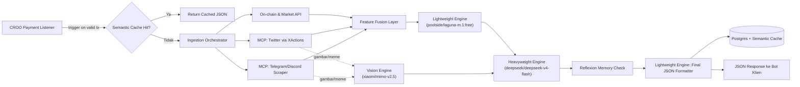
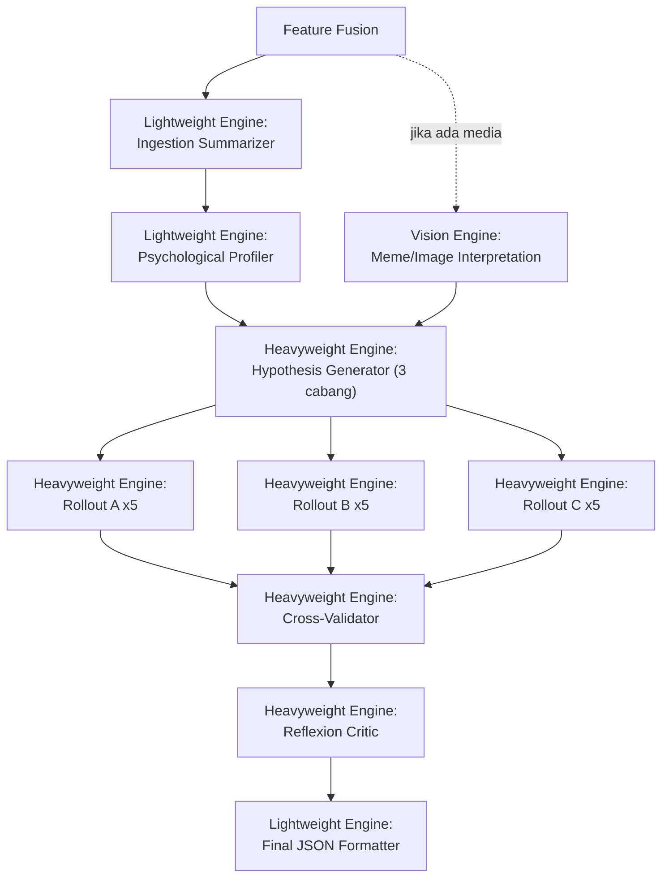

# FUD.ai
### The Crypto Drama Oracle — Epistemic Swarm Architecture (REVISI)
*Autonomous Agent-to-Agent Sentiment Oracle di atas protokol CROO — murni layanan API, tanpa chatbot*

> **Catatan revisi:** Dokumen ini menggantikan draft "Crypto Drama Oracle" sebelumnya. Perubahan utama: rebranding ke **FUD.ai**, penghapusan konsep chatbot/antarmuka percakapan, pemisahan LLM jadi 3 engine spesifik, ingestion berbasis MCP (bukan API resmi berbayar), semantic caching untuk efisiensi biaya, dan penambahan spesifikasi landing page + live dashboard.

---

## 0. Ringkasan Eksekutif

FUD.ai adalah **layanan API otonom (Agent-to-Agent)** — bukan produk chatbot — yang dijual pay-per-call di atas protokol **CROO**. Bot DeFi klien mengirim request + pembayaran USDC on-chain, FUD.ai menyedot data dari kanal sosial via **MCP (Model Context Protocol)** dan API on-chain langsung, memprosesnya lewat 3 LLM engine yang dipisah berdasarkan beban tugas untuk efisiensi biaya, lalu mengembalikan verdict JSON (`drama_index`, `evidence_chain`, `executable_verdict`).

Antarmuka publik FUD.ai **murni landing page**: dokumentasi API, halaman pricing (integrasi CROO Agent Store), dan live dashboard read-only sebagai proof of concept untuk juri. Tidak ada elemen percakapan/chatbot di produk ini.

---

## 1. Product Requirement Document (PRD)

### 1.1 Problem Statement

Pasar crypto, khususnya token kapitalisasi kecil, sangat rentan terhadap FUD terkoordinasi, rugpull, dan manipulasi whale. Sinyal-sinyal ini tersebar di banyak kanal (Twitter, Telegram, Discord, on-chain) yang tidak saling terhubung, dan tidak ada sistem yang murah secara operasional untuk memantau semuanya sekaligus secara otonom untuk konsumsi bot lain (bukan manusia).

### 1.2 Tujuan Produk

1. Menyediakan oracle sentimen **API-first, agent-to-agent**, dengan model bisnis pay-per-query di atas CROO — **tanpa antarmuka chatbot**.
2. Menekan biaya operasional serendah mungkin lewat pembagian beban ke 3 LLM engine berbeda + semantic caching, agar harga jual API tetap kompetitif di CROO Agent Store.
3. Menghasilkan verdict yang **actionable + explainable**, dengan evidence chain yang menelusuri sumber data mentah dari kanal sosial vs data on-chain.
4. Menyediakan landing page + live dashboard read-only sebagai bukti kerja sistem (proof of concept) untuk klien maupun juri, sepenuhnya terpisah dari inti layanan API.

### 1.3 Target Pengguna

| Persona | Kebutuhan |
|---|---|
| Bot trading DeFi (klien utama, non-human, via CROO) | Sinyal cepat, JSON terstruktur, murah per call |
| Pengunjung landing page (developer lain / juri) | Dokumentasi API jelas, contoh request/response, transparansi pricing |
| Juri hackathon CROO / TestSprite | Live dashboard sebagai bukti visual sistem bekerja nyata, bukan mock data |

**Catatan eksplisit:** tidak ada persona "pengguna chat" — semua interaksi manusia dengan produk ini bersifat *read-only* (baca dokumentasi, baca dashboard), bukan percakapan interaktif dengan agent.

### 1.4 Functional Requirements

| ID | Requirement | Prioritas |
|---|---|---|
| F1 | Listener mendeteksi pembayaran on-chain via smart contract CROO dan memicu pipeline analisa | Must |
| F2 | Ingestion data on-chain/market langsung via API (kuantitatif), dan data sosial via MCP connector (kualitatif) | Must |
| F3 | Routing task LLM ke 3 engine terpisah (Lightweight, Vision, Heavyweight) sesuai jenis tugas | Must |
| F4 | Modul profiling psikologis developer, dijalankan di Lightweight Engine | Must |
| F5 | Scenario tree reasoning (Hypothesis Generator, Rollout, Cross-Validator) dijalankan di Heavyweight Engine | Must |
| F6 | Analisa gambar/meme dijalankan murni di Vision Engine | Must |
| F7 | Reflexion loop menyimpan histori prediksi vs outcome aktual dan mengoreksi bobot | Must |
| F8 | Semantic caching (TTL 5 menit per koin) agar request berulang tidak memicu pemanggilan LLM ulang | Must |
| F9 | Output JSON baku: `drama_index`, `evidence_chain`, `executable_verdict`, `confidence` | Must |
| F10 | Landing page: Hero + API Docs, Pricing/CROO integration, Live Dashboard — **tanpa fitur chatbot** | Must |
| F11 | Live dashboard menampilkan drama index, visualisasi pohon skenario, evidence chain, dan responsif di perangkat mobile | Must |
| F12 | Rate limiting & validasi pembayaran on-chain sebelum trigger pipeline | Must |
| F13 | Auto-generate `LOOP.md` dari histori perbaikan bug TestSprite | Should |

### 1.5 Non-Functional Requirements

- **Latency**: target < 30 detik end-to-end per request (di luar cache hit).
- **Cost efficiency (KRITIS)**:
  - Pembagian beban ke 3 engine berbeda (bukan satu model generik untuk semua tugas) untuk menekan biaya per call.
  - **Semantic Caching**: implementasi via Upstash Redis, TTL 5 menit per kunci cache (berbasis `coin_symbol`, bisa diperluas ke embedding-based semantic match untuk request dengan intent sama tapi parameter beda tipis). Jika ada request untuk token yang sama dalam jendela 5 menit, API langsung mengembalikan hasil JSON dari cache **tanpa memicu pemanggilan LLM ulang sama sekali** (termasuk tanpa re-ingestion data mentah).
  - Trade-off yang perlu disadari: TTL 5 menit berarti selama kondisi pasar berubah sangat cepat (breaking FUD event), request kedua dalam jendela tsb tetap dapat data agak "basi" — dianggap acceptable untuk MVP demi cost saving.
- **Auditability**: evidence_chain wajib referensi sumber asli (nama kanal/channel_id, bukan cuma teks lepas).
- **Security**: validasi N block confirmation sebelum trigger pipeline.
- **Resilience**: jika satu MCP connector gagal (misal rate limited), pipeline tetap jalan dengan sumber lain (graceful degradation).
- **Mobile Responsiveness (KRITIS)**: seluruh live dashboard wajib diuji dan tidak boleh pecah pada perangkat mobile beresolusi tinggi, termasuk device uji spesifik **Realme RMX3472**, untuk memastikan pengalaman demo yang mulus bagi juri.

### 1.6 Scope MVP Hackathon

**In-scope:**
- 1 chain sesuai CROO, 1-2 token contoh untuk demo live dashboard
- Ingestion MCP untuk minimal 2-3 kategori kanal (boleh prioritaskan News/Market + Alpha/Signals dulu jika waktu terbatas)
- 3 engine LLM aktif sesuai spesifikasi (bukan 1 model generik)
- Semantic cache sederhana (key-based per coin_symbol, TTL 5 menit)
- Landing page 3 section penuh (Hero/Docs, Pricing, Live Dashboard)

**Out-of-scope (future work):**
- Multi-chain support
- Eksekusi order otomatis ke exchange dengan dana riil
- Semantic cache berbasis embedding similarity penuh (cukup key-based dulu untuk MVP)
- Chatbot / antarmuka percakapan apapun — **dihilangkan permanen dari roadmap produk ini**

### 1.7 Timeline

Deadline 8 Juli — prioritas: (1) pipeline inti + 3 engine jalan end-to-end, (2) semantic cache, (3) landing page & dashboard, (4) hardening via TestSprite + `LOOP.md`.

### 1.8 Success Metrics

- Verdict akurat dibandingkan pergerakan harga aktual 6–24 jam kemudian
- Cache hit rate terukur (menunjukkan penghematan biaya nyata ke juri)
- Endpoint lolos test brutal TestSprite tanpa 5xx error
- Dashboard tampil sempurna di device uji mobile (termasuk Realme RMX3472)
- `LOOP.md` lengkap dan terdokumentasi

---

## 2. High-Level Architecture



---

## 3. ERD (Entity Relationship Diagram)

```mermaid
erDiagram
    CLIENT ||--o{ ANALYSIS_REQUEST : submits
    ANALYSIS_REQUEST ||--|| PAYMENT_TRANSACTION : "dibayar via"
    ANALYSIS_REQUEST }o--|| COIN : "menganalisis"
    ANALYSIS_REQUEST ||--o| SEMANTIC_CACHE : "dicek terhadap"
    COIN ||--o{ SEMANTIC_CACHE : "kunci cache"
    COIN ||--o| DEVELOPER_PROFILE : "memiliki"
    ANALYSIS_REQUEST ||--o{ INGESTION_SNAPSHOT : menghasilkan
    INGESTION_SNAPSHOT ||--o| ORDER_BOOK_SNAPSHOT : "subtype onchain"
    INGESTION_SNAPSHOT ||--o{ SOCIAL_POST : "subtype sosial"
    SOCIAL_CHANNEL ||--o{ SOCIAL_POST : "sumber dari"
    SOCIAL_POST ||--o| VISION_ANALYSIS : "punya media"
    ANALYSIS_REQUEST ||--o{ MCTS_SIMULATION : menjalankan
    ANALYSIS_REQUEST ||--o{ ENGINE_CALL_LOG : mencatat
    ANALYSIS_REQUEST ||--|| VERDICT : menghasilkan
    VERDICT ||--o{ REFLEXION_LOG : "dievaluasi jadi"

    CLIENT {
        string client_id PK
        string wallet_address
        string api_key_hash
        timestamp created_at
    }

    PAYMENT_TRANSACTION {
        string tx_hash PK
        string from_wallet
        decimal amount_usdc
        string status "pending|confirmed|failed"
        int block_confirmations
        timestamp confirmed_at
    }

    ANALYSIS_REQUEST {
        string request_id PK
        string client_id FK
        string coin_id FK
        string tx_hash FK
        boolean served_from_cache
        string status "queued|ingesting|reasoning|done|failed"
        timestamp created_at
        timestamp completed_at
    }

    SEMANTIC_CACHE {
        string cache_key PK "coin_symbol + time_bucket_5min"
        string coin_id FK
        json cached_verdict
        int hit_count
        timestamp created_at
        timestamp expires_at
    }

    COIN {
        string coin_id PK
        string symbol
        string contract_address
        string chain
        timestamp first_seen
    }

    DEVELOPER_PROFILE {
        string dev_id PK
        string coin_id FK
        string social_handle
        string wallet_address
        int stress_score "0-100"
        int deception_risk_score "0-100"
        json historical_pattern_embedding_ref
        timestamp last_updated
    }

    INGESTION_SNAPSHOT {
        string snapshot_id PK
        string request_id FK
        string source_type "onchain|social|vision"
        json raw_payload
        timestamp fetched_at
    }

    ORDER_BOOK_SNAPSHOT {
        string snapshot_id FK
        json bids
        json asks
        boolean buy_wall_detected
        boolean sell_wall_detected
        decimal imbalance_ratio
    }

    SOCIAL_CHANNEL {
        string channel_id PK
        string channel_name
        string platform "twitter|telegram|discord"
        string category "news_market|alpha_signals|onchain_info|regional|grassroots_community"
        string mcp_connector "XActions|MCP_Scraper"
        boolean is_active
    }

    SOCIAL_POST {
        string post_id PK
        string snapshot_id FK
        string channel_id FK
        string author
        string content
        float sentiment_score
        string media_url
    }

    VISION_ANALYSIS {
        string post_id FK
        string image_url
        string meme_interpretation
        boolean cultural_red_flag "misal: koper = dev kabur"
    }

    MCTS_SIMULATION {
        string simulation_id PK
        string request_id FK
        string branch_name "A_kiamat_nyata|B_fud_palsu|C_manipulasi_paus"
        float probability
        json reasoning_trace
        int rollout_count
        float rollout_variance
    }

    ENGINE_CALL_LOG {
        string call_id PK
        string request_id FK
        string engine_tier "lightweight|vision|heavyweight"
        string model_name
        string prompt_step
        int latency_ms
        int token_usage
        decimal cost_estimate_usd
        timestamp created_at
    }

    VERDICT {
        string request_id PK FK
        int drama_index "0-100"
        json evidence_chain
        string executable_verdict "LIQUIDATE_LONGS|HOLD|ACCUMULATE|IGNORE_FUD"
        float confidence
        timestamp created_at
    }

    REFLEXION_LOG {
        string log_id PK
        string request_id FK
        string predicted_verdict
        string actual_outcome
        float error_margin
        float correction_weight_applied
        timestamp graded_at
    }
```

---

## 4. Rekomendasi Tech Stack

| Layer | Teknologi | Alasan |
|---|---|---|
| API Backend | Next.js 14/15 (App Router, Route Handlers) | Backend + landing page dalam satu codebase |
| Background job / pipeline | Inngest atau BullMQ + Upstash Redis | Pipeline multi-engine rawan timeout serverless |
| Database | PostgreSQL (Supabase/Neon) + Prisma ORM | Sesuai ERD di atas |
| Cache layer | **Upstash Redis** | Semantic caching TTL 5 menit — komponen kritis penekan biaya |
| On-chain listener | viem + wagmi, atau webhook CROO SDK | Deteksi pembayaran & data order book |
| **Lightweight Engine** | `poolside/laguna-m.1:free` via **OpenRouter** | Ingestion Summarizer, Psychological Profiler, Final Verdict Formatter (task ringan, butuh murah/cepat) |
| **Vision Engine** | `xiaomi/mimo-v2.5` via **OpenCode Go** | Khusus analisa gambar/meme dari Twitter & Telegram |
| **Heavyweight Reasoning Engine** | `deepseek/deepseek-v4-flash` via **OpenCode Go** | Hypothesis Generator, Rollout Simulator, Cross-Validator, Reflexion Critic |
| Ingestion sosial | **MCP XActions** (Twitter), **MCP Scraper** khusus (Telegram & Discord) | Mengganti API resmi berbayar |
| Ingestion on-chain/market | Bybit V5 API, DexScreener, GoPlus Security API, RugCheck.xyz, DeFiLlama | Tetap pakai API langsung karena data numerik (order book, contract risk) butuh presisi struktural — bukan sekadar teks yang bisa discrape dari channel |
| Testing & hardening | TestSprite CLI, Vitest | Sesuai workflow hackathon |
| Deployment | Vercel (API + landing page) + Railway/Fly.io (worker untuk koneksi persistent MCP scraper) | — |
| Observability | Sentry + auto-append `LOOP.md` | Dokumentasi ke juri |

> **Catatan penting:** slug model di OpenRouter/OpenCode Go (tier free/eksperimental khususnya) sering berubah atau di-deprecate. Cek ketersediaan `poolside/laguna-m.1:free`, `xiaomi/mimo-v2.5`, dan `deepseek/deepseek-v4-flash` di dashboard masing-masing platform sehari sebelum demo, dan siapkan fallback model cadangan di tier yang sama supaya pipeline tidak mati mendadak saat presentasi.

---

## 5. Data Ingestion

### 5.1 On-chain & Market Reality (tetap via API langsung)

Data ini bersifat numerik terstruktur (order book, likuiditas, keamanan kontrak) — tidak realistis digantikan scraping channel, sehingga tetap pakai API langsung (semuanya gratis/freemium, tidak melanggar prinsip "hindari API berbayar"):

| Sumber | Fungsi |
|---|---|
| Bybit V5 API | Order book depth, deteksi buy/sell wall |
| DexScreener API | Likuiditas & volume DEX untuk token kecil |
| GoPlus Security API | Cek honeypot, mint function, ownership |
| RugCheck.xyz API | Risk score kontrak |
| DeFiLlama API | TVL & kesehatan protokol |

### 5.2 Sentimen & Komunitas (via MCP — pengganti API resmi berbayar)

- **Twitter**: **MCP XActions** — membaca mention, reply, dan konten media terkait koin/dev target.
- **Telegram & Discord**: **MCP scraper khusus** — membaca pesan publik dari channel/grup target.

**Target channel yang wajib dimasukkan sebagai sumber referensi:**

| Kategori | Channel/Sumber |
|---|---|
| News/Market | CryptoPanic, Cointelegraph, The Block, Crypto News |
| Alpha/Signals | Crypto Signals, Whale Alerts, 100x Gems, Moonshot Calls |
| On-Chain Info (naratif/announcement, pelengkap API kuantitatif di 5.1) | Santiment, LunarCrush, Lookonchain, Arkham |
| Regional | Crypto Indonesia, Bitcoin Indonesia |
| Grassroots/Community | CryptoHub, Jacob's Crypto Clan, Discord resmi ekosistem (Solana, Base) |

Setiap channel didaftarkan sebagai row di tabel `SOCIAL_CHANNEL` (lihat ERD) dengan kategori dan connector MCP yang sesuai, sehingga evidence_chain nantinya bisa merujuk ke nama channel spesifik, bukan cuma "Twitter" secara umum.

> **Catatan risiko:** scraping via MCP terhadap channel publik tetap perlu memperhatikan Terms of Service masing-masing platform (khususnya Telegram/Discord). Untuk hackathon, batasi ke channel/grup yang memang publik dan tidak memerlukan bypass otentikasi.

### 5.3 Multimodal Vision

Gambar/meme yang terambil dari MCP XActions (Twitter) dan MCP Scraper (Telegram) diteruskan murni ke **Vision Engine (`xiaomi/mimo-v2.5` via OpenCode Go)** untuk interpretasi konteks kultural (misal: gambar koper → sinyal dev kabur). Engine ini tidak dipakai untuk task lain agar biaya inference vision (biasanya lebih mahal) hanya dikeluarkan saat benar-benar ada media untuk dianalisis.

---

## 6. Core Architecture — The Epistemic Brain (3-Engine Pipeline)

### 6.1 Alur Reasoning per Engine



### 6.2 Pembagian Tugas per Engine

| Engine | Model | Task |
|---|---|---|
| **Lightweight** | `poolside/laguna-m.1:free` (OpenRouter) | Ingestion Summarizer, Psychological Profiler, Final Verdict Formatter (JSON schema enforcement) |
| **Vision** | `xiaomi/mimo-v2.5` (OpenCode Go) | Interpretasi gambar/meme dari Twitter & Telegram |
| **Heavyweight Reasoning** | `deepseek/deepseek-v4-flash` (OpenCode Go) | Hypothesis Generator, Rollout Simulator, Cross-Validator, Reflexion Critic — inti "MCTS-inspired" reasoning |

Setiap pemanggilan dicatat di `ENGINE_CALL_LOG` (lihat ERD) — ini bukan cuma untuk debugging, tapi jadi bukti konkret ke juri soal berapa besar penghematan biaya dari pembagian 3-engine + semantic cache dibanding kalau semua task dilempar ke satu model besar.

### 6.3 Developer Psychological Profiling (Lightweight Engine)

Input: distribusi jam posting, rasio caps lock, volatilitas sentimen antar-post, latensi respons dev terhadap pertanyaan komunitas, similarity embedding ke pola rugpull historis.

Output:
```json
{
  "stress_score": 0-100,
  "deception_risk_score": 0-100,
  "key_signals": ["burst_posting_02:00", "caps_ratio_high"]
}
```

### 6.4 Scenario Tree + Self-Consistency Rollout (Heavyweight Engine)

Tetap memakai adaptasi "MCTS-inspired" (bukan MCTS klasik game-tree) seperti draft sebelumnya, seluruhnya dijalankan di `deepseek/deepseek-v4-flash`:

1. **Hypothesis Generator**: 3 cabang — *Kiamat Nyata*, *FUD Palsu*, *Manipulasi Paus* — dengan probabilitas kasar awal.
2. **Rollout Simulator**: 5 sampel LLM per cabang (temperature tinggi) memproyeksikan lintasan 1–24 jam ke depan.
3. **Cross-Validator**: bandingkan divergence antara sinyal sosial (dari MCP channels) vs sinyal on-chain (order book, wallet dev).
4. **Reflexion Critic**: bandingkan dengan kasus historis mirip dari `REFLEXION_LOG`, terapkan koreksi bobot bila ada bias sistematis.

```
score(branch) = w1 * rollout_agreement + w2 * cross_validation_alignment - w3 * reflexion_error_penalty
```

### 6.5 Final Verdict Formatter (Lightweight Engine, temperature 0)

```json
{
  "request_id": "req_abc123",
  "coin_symbol": "MEME",
  "drama_index": 85,
  "confidence": 0.78,
  "dominant_branch": "C_manipulasi_paus",
  "branch_probabilities": {
    "A_kiamat_nyata": 0.12,
    "B_fud_palsu": 0.23,
    "C_manipulasi_paus": 0.65
  },
  "evidence_chain": [
    "Channel 'Whale Alerts': transfer 2M token ke exchange terdeteksi",
    "MCP XActions: sell wall besar di Bybit tidak diikuti volume jual riil",
    "GoPlus Security: kontrak tidak mintable, liquidity terkunci 6 bulan"
  ],
  "executable_verdict": "IGNORE_FUD",
  "served_from_cache": false
}
```

---

## 7. Rancangan Website (Landing Page & Dashboard, Next.js)

**Prinsip utama: murni landing page. Tidak ada chatbot, tidak ada kolom input percakapan di mana pun di produk ini.**

### 7.1 Section 1 — Hero & API Documentation

- Value proposition FUD.ai dalam satu kalimat: oracle sentimen crypto agent-to-agent yang mendeteksi FUD, manipulasi, dan rugpull secara otonom.
- Dokumentasi endpoint: URL, parameter request (`coin_symbol`, `chain`), contoh request/response lengkap dengan struktur JSON `drama_index`.
- Copy-paste ready code snippet untuk bot developer (curl/JS fetch).

### 7.2 Section 2 — Pricing & CROO Integration

- Penjelasan model pay-per-call: bayar via USDC melalui protokol CROO Agent Store.
- Perbandingan biaya per call vs harga jual (transparansi soal semantic caching yang menekan biaya operasional).
- Link/CTA untuk listing/registrasi agent di CROO Agent Store.

### 7.3 Section 3 — Live Dashboard (Proof of Concept)

Read-only, real-time, menampilkan 1–2 koin yang sedang dipantau:

- **Skor FUD / Drama Index** — angka besar + indikator warna (hijau/kuning/merah).
- **Visualisasi Pohon Skenario** — representasi 3 cabang (Kiamat Nyata / FUD Palsu / Manipulasi Paus) beserta probabilitas masing-masing dari `MCTS_SIMULATION`.
- **Rantai Bukti (Evidence Chain)** — daftar bukti dari `SOCIAL_CHANNEL` (Telegram/Twitter) berdampingan dengan data on-chain, agar terlihat jelas kontras sinyal sosial vs sinyal pasar riil.
- **Mobile Responsiveness (wajib)**: layout grid harus reflow dengan benar di resolusi tinggi seperti **Realme RMX3472** — uji manual di device ini (atau emulator dengan resolusi/DPR yang sama) sebelum submission, pastikan tidak ada elemen dashboard yang overflow atau terpotong.

---

## 8. Executable Output & TestSprite Loop

Sama seperti draft sebelumnya: endpoint di-generate dengan bantuan AI coding assistant, di-debug brutal via **TestSprite CLI**, setiap iterasi perbaikan tercatat otomatis ke `LOOP.md` sebelum 8 Juli.

---

## 9. Risiko & Mitigasi

| Risiko | Mitigasi |
|---|---|
| Model free-tier di OpenRouter/OpenCode Go di-deprecate mendadak | Siapkan model fallback di tier sejenis untuk masing-masing engine, tes ulang H-1 sebelum demo |
| MCP scraper kena rate limit / ToS platform | Fallback antar-channel dalam kategori yang sama, cache hasil ingestion mentah |
| Semantic cache TTL 5 menit membuat data agak basi saat FUD bergerak sangat cepat | Diterima sebagai trade-off MVP; bisa ditambah cache-busting manual untuk kasus ekstrem di masa depan |
| Dashboard pecah di device mobile tertentu | Wajib manual test di Realme RMX3472 (atau device dengan resolusi/DPR setara) sebelum submission |
| `executable_verdict` disalahgunakan untuk auto-trade dana riil | Posisikan sebagai rekomendasi, bukan nasihat keuangan berlisensi — bukan bagian dari scope MVP |

---

*Dokumen ini siap dipakai sebagai basis README.md, naskah demo video, maupun slide presentasi ke juri CROO/TestSprite untuk FUD.ai.*
