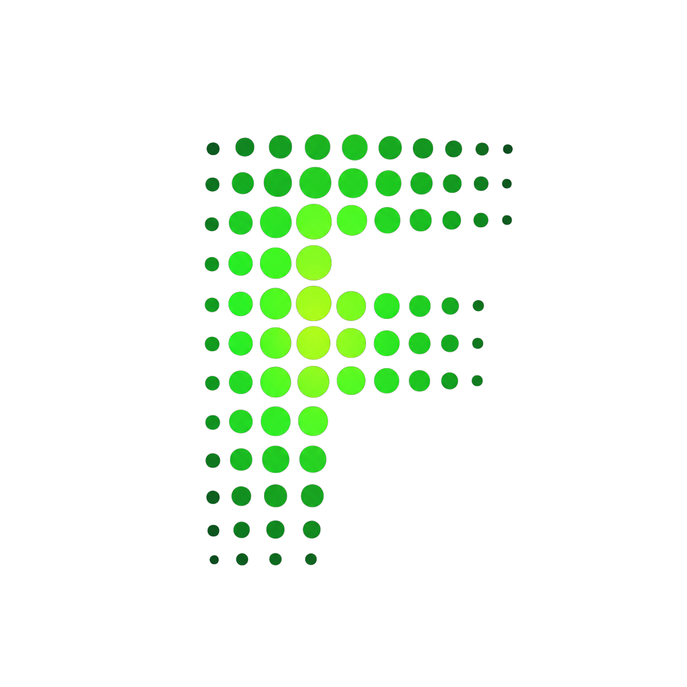

<p align="center">
  
</p>

# FUD.ai

> *Agentic on-chain intelligence that detects coordinated FUD and rug-pull manipulation in real time.*

[](https://github.com/chulopp/FUD.ai)
[](https://github.com/chulopp/FUD.ai)
[](LICENSE)

---

## Quick Links

| | |
|---|---|
| **Website** | [fudai-two.vercel.app](https://fudai-two.vercel.app/) |
| **Docs** | [fudai-two.vercel.app/docs](https://fudai-two.vercel.app/docs) |
| **CROO Agent** | [Hire FUD.ai on CROO](https://agent.croo.network/agents/4799b7fe-3b19-4435-bdfe-93de07ec5c40?from=search) |
| **Live Demo (Video)** | [YouTube](https://youtu.be/rAsAm_W4LKU) |
| **X (Twitter)** | [x.com/fuddulu](https://x.com/fuddulu) |
| **GitHub** | [github.com/chulopp/FUD.ai](https://github.com/chulopp/FUD.ai) |

---

## The Core

Crypto markets don't just move on news — they move on **manufactured fear**. Coordinated FUD campaigns, sybil-driven sentiment attacks, and whale manipulation rug-pulls destroy portfolios before any human can react.

**FUD.ai** is an agentic intelligence layer that solves this. It fuses **on-chain evidence**, **social signals**, and **explicit coordination detection** in real time, then reasons across multiple scenarios using an **MCTS-inspired epistemic reasoning loop** to deliver a single executable verdict.

### Why FUD.ai, not ChatGPT or a sentiment aggregator?

| | General AI | Sentiment Aggregator | **FUD.ai** |
|---|---|---|---|
| **On-chain grounding** | None | Inconsistent | GoPlus + RugCheck + DexScreener + Bybit order book |
| **Coordination detection** | None | Not explicit | Author ratio + duplicate-text clustering + burst windows |
| **Reasoning** | Single answer | Score aggregation | 3 parallel MCTS branches with probability distribution |
| **Self-correction** | No memory | No memory | Reflexion loop — learns from past misses |
| **Agent-to-agent** | Not native | Not native | CROO CAP native, on-chain settlement |

### Pricing

**$0.02 USDC per call.** No subscription, no monthly fee, no minimum commitment. Pay-per-call via the **CROO CAP protocol** on **Base mainnet** — settlement is on-chain and automatic. You only pay for successful analyses.

---

## Architecture Overview

FUD.ai is built on an **async job pattern** designed for reliability under heavy computational load.

```
┌─────────────┐     POST /api/agent      ┌───────────────┐
│  Requester   │────────────────────────▶│  Next.js API  │
│  (Agent)     │◀─── 202 + job_id ───────│  Route (Vercel)│
└─────────────┘                          └───────┬───────┘
       │                                          │ waitUntil()
       │   GET /api/agent/{job_id} (poll 2-3s)    │
       └──────────────────────────────────────▶  ▼
                                         ┌───────────────┐
                                         │  MCTS Pipeline │
                                         │  (background)  │
                                         └───────┬───────┘
                                                 │
                                    ┌────────────┼────────────┐
                                    ▼            ▼            ▼
                              ┌──────────┐ ┌──────────┐ ┌──────────┐
                              │ On-chain │ │ Social   │ │ Market   │
                              │ Ingestion│ │ Scraping │ │ Data     │
                              │ GoPlus   │ │ Twitter  │ │ Bybit    │
                              │ RugCheck │ │ Telegram │ │ DexScr   │
                              │ CoinGecko│ │ (native) │ │ DefiLlama│
                              └──────┬───┘ └──────┬───┘ └──────┬───┘
                                     └────────────┼────────────┘
                                                  ▼
                                          ┌───────────────┐
                                          │  Coordination  │
                                          │  & Sybil Detect│
                                          └───────┬───────┘
                                                  ▼
                                          ┌───────────────┐
                                          │  MCTS Reasoning│
                                          │  Branch A/B/C  │
                                          │  + Reflexion   │
                                          └───────┬───────┘
                                                  │
                                                  ▼
                                          ┌───────────────┐
                                          │  Upstash Redis │
                                          │  (job store)   │
                                          └───────────────┘
```

### Key design decisions

- **Async, not synchronous** — The full pipeline can take up to **150 seconds (2.5 minutes)**. A sync HTTP response would timeout on most infrastructure. `POST /api/agent` returns `202 + job_id` in < 1 second; the pipeline runs via `waitUntil()` in the background and writes results to Redis.
- **Upstash Redis** (REST-based, not TCP) — serves as **job store**, **concurrency limiter**, and **ingestion cache**. No Redis server to manage.
- **MCTS reasoning engine** — evaluates three parallel scenarios (**Real Crash / False FUD / Whale Manipulation**) against the evidence chain, producing a probability distribution and a dominant branch.
- **Reflexion loop** — records every verdict. When a past prediction is wrong, the loop extracts what the evidence missed and recalibrates confidence for similar future cases.
- **CROO provider worker** — a separate process (`scripts/croo-provider-worker.ts`) connects to the CROO CAP WebSocket and handles agent-to-agent settlement on Base. Deploy as a **single replica** (CROO enforces 1 API Key = 1 WebSocket).

---

## Quick Start

### Prerequisites

- **Node.js 18+** and npm
- An **Upstash Redis** instance ([upstash.com](https://upstash.com) — free tier works)
- API keys for at least one LLM engine (OpenRouter or Gemini or DeepSeek)
- Optional: CROO SDK key (for production agent-to-agent settlement)

### 1. Clone

```bash
git clone https://github.com/chulopp/FUD.ai.git
cd FUD.ai
```

### 2. Install

```bash
npm install
```

### 3. Configure environment

Copy the example file and fill in your keys:

```bash
cp .env.example .env.local
```

**Core environment variables:**

```bash
# ─── LLM Engines (at least one required) ───
OPENROUTER_API_KEY=
GEMINI_API_KEY=
DEEPSEEK_API_KEY=
DEEPSEEK_BASE_URL=https://api.deepseek.com

# ─── Upstash Redis (job store + cache + concurrency) ───
# Get these from your Upstash console
UPSTASH_REDIS_REST_URL=
UPSTASH_REDIS_REST_TOKEN=

# ─── On-Chain & Market APIs ───
BYBIT_API_KEY=
BYBIT_API_SECRET=
BYBIT_BASE_URL=https://api.bytick.com
GOPLUS_APP_KEY=
GOPLUS_APP_SECRET=
RUGCHECK_API_KEY=
DEXSCREENER_API_KEY=
DEFILLAMA_API_KEY=
COINGECKO_API_KEY=

# ─── Social Scrapers ───
RAPIDAPI_KEY=
RAPIDAPI_HOST=twitter-api45.p.rapidapi.com
# Telegram: no credentials needed (public web scraping)

# ─── CROO CAP Protocol (production agent-to-agent) ───
CROO_API_URL=https://api.croo.network
CROO_WS_URL=wss://api.croo.network/ws
CROO_SDK_KEY=croo_sk_...
BASE_RPC_URL=
```

### 4. Run

```bash
npm run dev
```

Open [http://localhost:3000](http://localhost:3000) for the landing page + live demo.
Open [http://localhost:3000/docs](http://localhost:3000/docs) for the documentation.

### 5. (Optional) Start the CROO provider worker

For production agent-to-agent settlement via CROO CAP:

```bash
npm run croo:worker
```

> **Note:** Deploy this worker as a **single replica**. CROO enforces 1 API Key = 1 WebSocket connection — duplicate instances get disconnected with code 1008.

---

## Tech Stack & Features

### Stack

| Layer | Technology |
|---|---|
| **Framework** | Next.js 16.2.10 (App Router, Turbopack) |
| **Language** | TypeScript 5 |
| **UI** | React 19, Tailwind CSS v4, Framer Motion, Recharts, Lucide Icons |
| **Docs** | Fumadocs (MDX, integrated in same app at `/docs`) |
| **State / Cache** | Upstash Redis (REST-based serverless Redis) |
| **AI / Reasoning** | MCTS-inspired multi-branch engine, Reflexion loop, OpenRouter / Gemini / DeepSeek / AWS Bedrock |
| **On-chain data** | GoPlus Security, RugCheck, DexScreener, CoinGecko, DefiLlama, Bybit |
| **Social signals** | agent-twitter-client (native), Telegram web scraper (axios + cheerio) |
| **Agent protocol** | CROO CAP SDK (`@croo-network/sdk`), Base mainnet settlement |
| **Validation** | Zod 4 |

### Features

- **Real-time manipulation detection** — distinguishes organic fear from coordinated FUD campaigns using explicit coordination metrics
- **Coordination & Sybil detection** — `unique_author_ratio`, `duplicate_text_cluster_size` (Jaccard clustering), `cross_platform_burst_window_minutes`
- **MCTS-inspired reasoning** — three parallel scenarios (Real Crash / False FUD / Whale Manipulation) scored against cross-validated evidence
- **Reflexion loop** — learns from incorrect past predictions, auto-calibrates confidence
- **Async job pattern** — `202 + job_id` + polling, max pipeline time 150 seconds
- **8-field structured verdict** — `executable_verdict`, `drama_index`, `confidence`, `dominant_branch`, `evidence_chain`, `coordination_signals`, `served_from_cache`, `branch_probabilities`
- **Pay-per-call at $0.02 USDC** — on-chain settlement via CROO CAP on Base, no subscriptions
- **Agent-to-agent native** — callable directly by any bot/agent, programmatic hiring and budget management
- **Light & dark mode** — dark-mode-first design, smooth theme transitions
- **Live demo** — rate-limited (2 calls/week per device) showcase on the landing page
- **Full documentation** — Quickstart, Core Concepts, API Reference, FAQ, built with Fumadocs

---

## Project Structure

```
FUD.ai/
├── app/
│   ├── api/
│   │   ├── agent/route.ts          # POST /api/agent (async job submit)
│   │   ├── agent/[job_id]/route.ts # GET /api/agent/{job_id} (poll)
│   │   ├── cron/calibrate/route.ts # Reflexion calibration cron
│   │   └── search/route.ts         # Fumadocs Orama search
│   ├── components/                 # Navbar, Hero, Live Demo, Verdict, etc.
│   ├── docs/                       # Fumadocs route (/docs)
│   ├── lib/
│   │   ├── mcts/                   # MCTS pipeline, dispatcher, calibration
│   │   ├── ingestion/              # 8-provider ingestion layer
│   │   ├── llm/                    # LLM engine abstractions
│   │   ├── redis/                  # Job store, concurrency, cache
│   │   └── utils/                  # CROO schema, fetch-with-timeout
│   ├── page.tsx                    # Landing page (8 sections)
│   ├── layout.tsx                  # Root layout (theme, fonts, metadata)
│   └── globals.css                 # Design tokens, dot matrix, theme vars
├── components/
│   └── mdx.tsx                     # MDX components (YouTube embed, TypeTable)
├── content/docs/                   # Fumadocs MDX content (12 pages)
├── lib/
│   ├── source.ts                   # Fumadocs source loader
│   └── layout.shared.tsx           # Shared docs layout config
├── public/
│   └── LOGOFUD.svg                 # Brand logo
├── scripts/
│   └── croo-provider-worker.ts     # CROO CAP worker (separate process)
├── source.config.ts                # Fumadocs MDX config
├── next.config.mjs                 # Next.js + Fumadocs MDX plugin
└── .env.example                    # Environment variable template
```

---

## License

This project is licensed under the **MIT License**. See the [LICENSE](LICENSE) file for details.

---

<p align="center">
  Built for the CROO Agent Store. Settlement on Base. Powered by MCTS epistemic reasoning.
</p>
