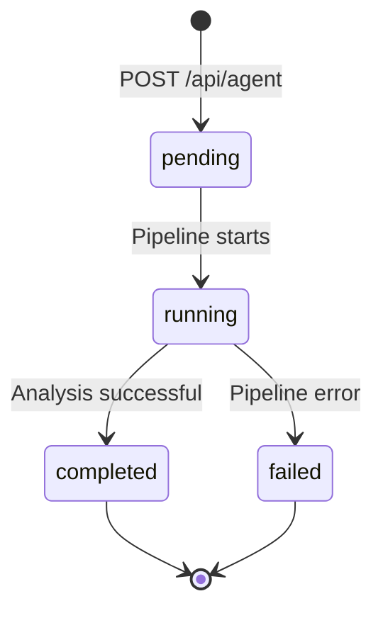

## Request

```http
GET /api/agent/{job_id} HTTP/1.1
X-Demo-Fingerprint: {your_fingerprint}
```

### Path parameters

| Parameter | Type | Description |
|---|---|---|
| `job_id` | string (UUID) | The job ID returned by POST /api/agent |

## Response — 200 OK (pending/running)

```json
{
  "job_id": "550e8400-e29b-41d4-a716-446655440000",
  "status": "running",
  "coin_symbol": "PEPE"
}
```

## Response — 200 OK (completed)

```json
{
  "job_id": "550e8400-e29b-41d4-a716-446655440000",
  "status": "completed",
  "coin_symbol": "PEPE",
  "payload": {
    "request_id": "auto-generated-uuid",
    "coin_symbol": "PEPE",
    "status": "ok",
    "executable_verdict": "ACCUMULATE",
    "confidence": 0.82,
    "drama_index": 38,
    "chatter_level": 45,
    "risk_score": 33,
    "dominant_branch": "false_fud",
    "branch_probabilities": {
      "real_crash": 0.12,
      "false_fud": 0.65,
      "whale_manipulation": 0.23
    },
    "evidence_chain": [
      "[SECURITY] No honeypot detected, contract is verified",
      "[SYBIL] unique_author_ratio: 0.71 — organic discussion pattern",
      "[ON-CHAIN] No abnormal exchange inflows detected"
    ],
    "coordination_signals": {
      "unique_author_ratio": 0.71,
      "duplicate_text_cluster_size": 2,
      "cross_platform_burst_window_minutes": 0
    },
    "served_from_cache": false,
    "pipeline_elapsed_ms": 23400
  }
}
```

<Callout type="info">
  The `payload` object contains additional internal fields (`status`, `chatter_level`, `risk_score`, `pipeline_elapsed_ms`) that are not part of the CROO deliverable schema but are useful for debugging and observability.
</Callout>

## Response — 200 OK (failed)

```json
{
  "job_id": "550e8400-e29b-41d4-a716-446655440000",
  "status": "failed",
  "error": "All LLM engines timed out after 60s"
}
```

## Response — 404 Not Found

```json
{
  "error": "Job not found"
}
```

## Status transitions



## Polling best practices

1. **Interval**: 2-3 seconds
2. **Timeout**: 150 seconds (2.5 minutes) maximum
3. **Stop conditions**: `completed` or `failed`
4. **Retry on network errors**: Continue polling — transient network blips should not abort the job
