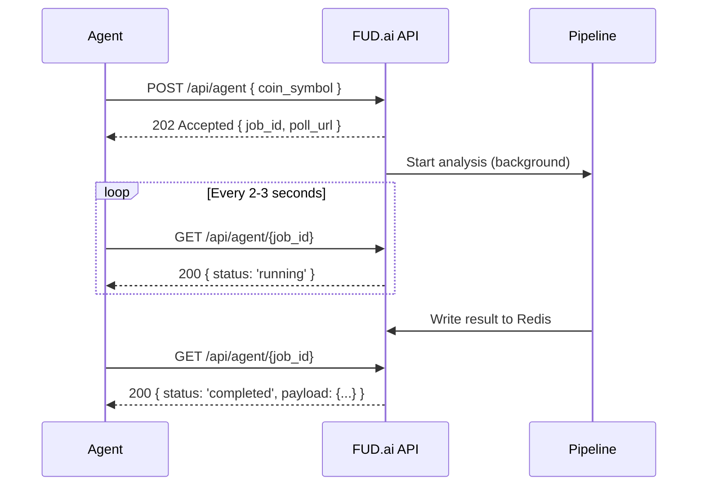

## Why async?

FUD.ai's analysis pipeline is computationally expensive. Each request triggers:

1. **Ingestion** — fetching on-chain data from GoPlus, RugCheck, DexScreener, Bybit order book
2. **Social scraping** — pulling real-time Twitter and Telegram signals
3. **Coordination analysis** — computing sybil metrics, duplicate-text clustering, burst windows
4. **MCTS reasoning** — running three parallel scenario branches
5. **Reflexion lookup** — checking past predictions for calibration

This entire pipeline takes up to **150 seconds (2.5 minutes)** depending on coin liquidity and social volume. A synchronous HTTP response would timeout on most infrastructure (Vercel functions cap at 60s, many client libraries timeout at 30s).

## The flow

## Job statuses

| Status | Meaning |
|---|---|
| `pending` | Job accepted, not yet started |
| `running` | Pipeline is executing |
| `completed` | Analysis finished, verdict available in `payload` |
| `failed` | Pipeline encountered an error, check `error` field |

## Polling recommendations

- **Interval**: 2-3 seconds is optimal. Faster wastes bandwidth, slower adds latency.
- **Timeout**: Poll for up to **150 seconds (2.5 minutes)**. If the job hasn't completed by then, treat it as timed out.
- **Exponential backoff**: Optional but recommended for production — start at 2s, increase to 3s after 30 seconds.

## What if the job is stuck?

In rare cases (e.g., dev server restart), a job may remain in `running` status indefinitely. Always implement a client-side timeout. On Vercel production, `waitUntil()` ensures correct lifecycle management.

<Callout type="warn">
  If you receive `INSUFFICIENT_DATA` as the verdict, the pipeline ran in degraded mode. Do not treat this as a valid trading signal — it means some data sources were unavailable.
</Callout>
