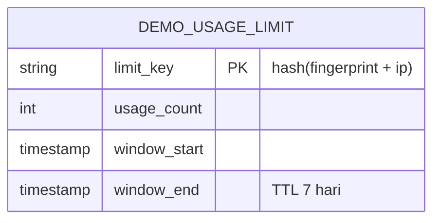

# FUD.ai — Frontend PRD & ERD (Landing Page + Documentation)

Referensi desain: struktur section dari [ascn.ai/ai-agent-crypto](https://ascn.ai/ai-agent-crypto) untuk landing page,
gaya dokumentasi dari [docs.testsprite.com](https://docs.testsprite.com) (dibangun di atas Mintlify) untuk halaman docs.

---

## 1. PRD

### 1.1 Tujuan
Frontend FUD.ai terdiri dari **2 halaman saja**: Landing Page dan Documentation. Tidak ada login, tidak ada chatbot,
tidak ada dashboard user pribadi. Landing page berfungsi sebagai showcase + live demo terbatas, documentation
berfungsi sebagai referensi teknis untuk developer/bot yang mau integrasi.

### 1.2 Non-Goals (eksplisit, biar gak melebar pas implementasi)
- Tidak ada sistem akun/login
- Tidak ada chatbot/kolom percakapan di manapun
- Tidak ada dashboard riwayat analisa personal per user
- Live demo bukan produk utama — ini showcase terbatas (rate-limited), bukan API gratis pengganti CAP

### 1.3 Information Architecture

```
/                       → Landing Page (single-page scroll, 8 section)
/docs                   → Documentation home
/docs/quickstart        → Cara integrasi via CROO CAP
/docs/api-reference     → Detail endpoint & response schema
/docs/concepts          → Konsep async job, verdict schema, evidence chain
/docs/faq               → FAQ
/docs/changelog         → (opsional, isi setelah ada versi)
```

**Rekomendasi:** docs dibangun dalam Next.js app yang SAMA (route `/docs`) pakai **Fumadocs**, bukan subdomain
terpisah kayak `docs.fud.ai`. Alasan: seluruh stack lu sudah "murni Next.js", satu deployment Vercel, gak perlu
setup hosting/DNS terpisah, dan theme light/dark bisa di-share persis sama antara landing & docs tanpa duplikasi
config. Alternatif kalau mau visual 1:1 sama TestSprite dengan effort custom-styling paling minim: **Mintlify**
(gratis untuk open source, tapi jadi subdomain terpisah dan butuh maintain 2 deployment). Rekomendasi: **Fumadocs**,
mengingat waktu terbatas dan prinsip "satu codebase" yang sudah dipegang sejak awal.

### 1.4 Design System
- **Light & dark mode wajib di kedua halaman**, pakai `next-themes`, preferensi tersimpan di localStorage +
  fallback `prefers-color-scheme`
- Aesthetic direction: dark-mode-first (dominan di kalangan produk crypto/security), tema "hacker terminal" untuk
  komponen live demo, warna aksen mengikuti semantic verdict (hijau neon = ACCUMULATE/bullish, merah darah =
  LIQUIDATE_LONGS/bearish, kuning/amber = IGNORE_FUD/netral) — dipakai konsisten di badge, gauge, dan aksen UI
- Font: monospace untuk elemen "terminal"/kode (JetBrains Mono atau IBM Plex Mono), sans-serif untuk body copy
  (Inter atau Geist, sudah native di Next.js)
- Komponen: **shadcn/ui** sebagai base (konsisten dengan ekosistem Next.js + Tailwind yang sudah dipakai backend),
  **Framer Motion** untuk animasi scroll (sticky stack, terminal typing effect)

### 1.5 Non-Functional Requirements
- Mobile responsiveness wajib teruji di resolusi tinggi (lanjutan requirement lama: Realme RMX3472 atau setara)
- Animasi sticky-stack & terminal simulator harus tetap 60fps di device mobile mid-range — hindari animasi berat
  yang nge-drop frame, prioritaskan `transform`/`opacity` (GPU-accelerated) di atas properti lain
- Lighthouse Performance score landing page target >85 (SEO dan aksesibilitas turut dinilai di kriteria
  Presentation & Usability judging CROO)
- SEO dasar: meta title/description, OG image, sesuai pola yang dipakai ASCN di referensi

---

## 2. Landing Page — Detail per Section

### Section 1 — Navbar + Hero
- Navbar: logo FUD.ai, link ke Docs, tombol CTA "List on CROO Agent Store" (link keluar ke listing FUD.ai di
  agent.croo.network), toggle light/dark
- Hero: judul besar (value proposition dalam satu kalimat) + subjudul + 2 tombol CTA:
  - Primary: "View on CROO Agent Store" → link ke listing
  - Secondary: "See it in action" → scroll ke Section 4 (Live Demo)
- **Beda dari ASCN**: tidak ada chat box interaktif di hero (sesuai keinginan lu) — cukup teks statis + CTA.
  Elemen visual pengganti: bisa pakai potongan JSON verdict sebagai dekorasi background (samar, di-blur) untuk
  kasih preview "look" produk tanpa bikin hero jadi interaktif.

### Section 2 — "Why General AI Doesn't Work in Crypto" (Pancingan)
Format 2 kartu perbandingan (seperti ASCN: "General AI" vs "Exchange AI Assistant"), tapi isi disesuaikan
konteks FUD.ai — fokusnya bukan "general trading advice" tapi spesifik ke **deteksi manipulasi**:

| Kartu | Judul | Isi |
|---|---|---|
| 1 | General AI (ChatGPT/Claude/Gemini) | Analisis dari data statis, gak baca sinyal on-chain real-time, gak bisa bedain FUD organik vs kampanye terkoordinasi |
| 2 | Sentiment Aggregator biasa (LunarCrush/Santiment-style) | Cuma agregasi skor sentimen, gak ada deteksi eksplisit pola sybil/koordinasi, gak grounded ke data kontrak on-chain |

### Section 3 — About / Sticky Stacked Cards
**Cara kerja teknis (biar "persis" ASCN, bukan cuma mirip):**
Ini scroll-linked stacking effect, dieksekusi dengan `position: sticky` + Framer Motion `useScroll`/`useTransform`
(BUKAN CSS Scroll-Timeline API native — dukungan browser masih belum konsisten di Safari/Firefox per awal 2026,
Framer Motion lebih reliable lintas browser untuk demo ke juri):

1. Container scroll setinggi `N × 100vh` (N = jumlah card) supaya ada "runway" scroll
2. Tiap card `position: sticky; top: 80px` dengan container individual setinggi `100vh`
3. Card yang lebih baru menutup card sebelumnya secara natural karena efek sticky + z-index bertingkat
4. Tambahkan `scale` dan `opacity` transform halus pada card yang "ditinggalkan" (turun ke 0.95 scale, opacity 0.6)
   berdasarkan `scrollYProgress` dari Framer Motion, supaya transisinya kerasa "hidup" bukan cuma numpuk statis

**Isi 4 card (mengikuti pola ASCN: 01/04 - 04/04, tiap card = satu pilar arsitektur):**
1. Multidimensional Ingestion — data on-chain + sosial + visual sekaligus
2. Coordination & Sybil Detection — deteksi pola bot/koordinasi eksplisit, bukan cuma sentimen
3. MCTS-Inspired Reasoning — 3 skenario paralel (Real Crash / FUD Palsu / Manipulasi Paus)
4. Reflexion Loop — belajar dari prediksi masa lalu yang salah, kalibrasi confidence otomatis

### Section 4 — Live Demo / Terminal Simulator
**Alur UX:**
1. Input field: user masukin coin symbol (misal `PEPE`)
2. Submit → `POST /api/agent` (endpoint yang sudah ada) → dapat `job_id`
3. **Sementara polling `GET /api/agent/{job_id}` berjalan di background**, komponen terminal nampilin
   animasi log bergaya "hacker terminal" (typewriter effect, teks muncul karakter demi karakter):
   ```
   > Scraping Twitter & Telegram signals...
   > Scanning smart contract on-chain vulnerabilities...
   > Computing coordination & sybil signals...
   > Running MCTS hypothesis branches (A/B/C)...
   > Cross-validating social vs on-chain pressure...
   > Checking reflexion memory for similar past cases...
   ```
4. **Penting:** log ini murni kosmetik (gak nunggu step asli selesai satu-satu), TAPI total durasi animasi harus
   di-sinkronkan kasar dengan estimasi waktu polling asli (kalau job selesai duluan sebelum animasi log habis,
   percepat animasi ke akhir; kalau job belum selesai setelah animasi log habis, loop 1-2 baris log tambahan
   generik seperti `> Still verifying evidence chain...` sambil nunggu)
5. Begitu job `completed` → transisi ke Section 5 (Verdict Showcase)

**Rate limiting — 2x per minggu per device:**
Ini bukan boundary keamanan yang bulletproof (device fingerprinting sempurna itu gak mungkin di web tanpa native
app), jadi treat sebagai **soft speed-bump untuk cegah abuse biaya API demo**, bukan proteksi ketat:

1. Generate fingerprint sisi client: kombinasi `navigator.userAgent` + `screen.width/height` + timezone,
   di-hash (SHA-256) jadi satu string — gak perlu library fingerprinting berat (FingerprintJS dkk) untuk MVP,
   overkill untuk kasus ini
2. Simpan hash ini di localStorage DAN kirim ke backend sebagai header custom (`X-Demo-Fingerprint`)
3. Backend: gabungkan fingerprint + hash IP address jadi satu key, cek counter di **Redis (Upstash, sudah ada
   di stack)** dengan TTL 7 hari: `demo_limit:{fingerprint_ip_hash}` → increment, kalau sudah ≥2, tolak dengan
   pesan jelas ("Demo limit tercapai, integrasikan via CROO Agent Store untuk akses penuh") + CTA ke Section 7
4. **Batasan yang jujur perlu didokumentasikan ke diri sendiri**: clear localStorage / incognito / VPN bisa
   bypass ini dengan mudah. Itu OK — tujuannya cuma mencegah orang iseng spam demo berkali-kali dalam sesi
   normal, bukan mencegah penyalahgunaan serius. Kalau butuh lebih ketat, baru worth pertimbangkan captcha
   (misal Cloudflare Turnstile) di percobaan ke-2.

### Section 5 — Verdict Showcase
Muncul setelah live demo `completed`, render 8 field JSON jadi visual:

| Field | Komponen Visual |
|---|---|
| `drama_index` | Gauge meter melingkar (SVG custom atau `RadialBarChart` dari Recharts), warna gradasi sesuai nilai |
| `confidence` | Progress bar linear di bawah gauge, dengan label persentase |
| `executable_verdict` | Badge besar mencolok — mapping warna: `ACCUMULATE`/`IGNORE_FUD` → hijau neon, `LIQUIDATE_LONGS` → merah darah, status `degraded`/`INSUFFICIENT_DATA` → abu-abu/amber (bukan hijau/merah, supaya gak terlihat seperti keputusan pasti) |
| `dominant_branch` + `branch_probabilities` | Mini bar chart 3 cabang (Real Crash / FUD Palsu / Manipulasi Paus) |
| `evidence_chain` | List/tabel rapi, tiap item dengan prefix kategori (`[SECURITY]`, `[SYBIL]`, `[ON-CHAIN]`) sesuai yang sudah diimplementasi di backend |
| `coordination_signals` | Tabel kecil terpisah: `unique_author_ratio`, `avg_account_age_days`, dll — ini yang paling penting ditonjolkan ke juri karena ini diferensiator utama produk |

### Section 6 — "FUD.ai vs Everyone Else" (Tabel Perbandingan)
Mengikuti format tabel ASCN persis (3 kolom, N baris kriteria), tapi isi kolom & kriteria disesuaikan konteks
FUD.ai. Rekomendasi kolom & kriteria (silakan sesuaikan copy-nya, ini kerangka isi):

| Kriteria | General AI (ChatGPT/Claude/Gemini) | Sentiment Aggregator (LunarCrush/Santiment-style) | FUD.ai |
|---|---|---|---|
| Fokus | AI umum, crypto cuma salah satu topik | Agregasi skor sentimen sosial | Spesialis deteksi manipulasi & rugpull, epistemic reasoning multi-cabang |
| Deteksi koordinasi/sybil | Tidak ada | Umumnya tidak eksplisit | Modul eksplisit: author ratio, account age, duplicate-text clustering |
| Grounding on-chain | Tidak punya akses on-chain | Terbatas/tidak konsisten | Cross-validated dengan RugCheck, GoPlus, DexScreener, order book real-time |
| Self-correction | Tidak ada memori antar-query | Tidak ada | Reflexion Loop — belajar dari prediksi salah, kalibrasi confidence otomatis |
| Model bisnis | Berlangganan/API generik | Berlangganan | Pay-per-call A2A via CROO CAP, agent lain bisa hire sebagai dependency |
| Akses agent-to-agent | Tidak native | Tidak native | Native — callable langsung oleh bot/agent lain, settlement on-chain |

### Section 7 — Pricing / CTA ke CROO
Bukan pricing table tradisional (karena FUD.ai bukan model subscription) — cukup 1 blok CTA yang jelasin:
model bayar per-panggilan via USDC lewat CROO CAP, harga per call, link langsung ke listing di
agent.croo.network, plus 1-2 baris singkat "cara kerja" (negotiate → pay → deliver) biar orang awam CROO
juga paham konteksnya sebelum klik keluar.

### Section 8 — Footer
Link ke Docs, link ke listing CROO Agent Store, link repo GitHub (open source, sesuai requirement hackathon),
kontak/social (opsional), copyright.

---

## 3. Documentation — Struktur Konten yang Direkomendasikan

Karena lu belum tentuin isinya, ini kerangka minimal tapi lengkap, mengikuti pola TestSprite (Introduction →
Quickstart → Konsep → API Reference):

1. **Introduction** — apa itu FUD.ai, kenapa agent lain butuh ini, link cepat ke Quickstart
2. **Quickstart** — cara integrasi sebagai Requester via CROO CAP SDK, dari nol sampai first call (mirror pola
   "15 minutes from zero to first call" ala CAP SDK quickstart resmi)
3. **Core Concepts**:
   - Async job pattern (kenapa `202 + job_id` bukan response langsung, cara polling)
   - Struktur verdict JSON (8 field, dijelasin satu-satu — ini bisa reuse isi dari section Verdict Showcase)
   - Evidence chain & coordination signals — gimana cara membacanya
4. **API Reference** — detail endpoint (`POST /agent`, `GET /agent/{job_id}`), parameter, contoh request/response,
   error code
5. **Rate Limits & Pricing** — batas request kalau ada, harga per call
6. **FAQ** — pertanyaan umum (kenapa async, kenapa butuh CROO wallet, dst)
7. **Changelog** — kosongkan dulu, isi setelah versi pertama live

---

## 4. ERD (Entitas Baru Khusus Frontend)

Sebagian besar data (verdict, evidence chain, dst) sudah ada di ERD backend — frontend cuma konsumsi lewat API.
Entitas BARU yang perlu ditambahkan khusus untuk kebutuhan frontend:



**Catatan:** preferensi light/dark mode TIDAK perlu entitas database — cukup disimpan client-side
(localStorage via `next-themes`), tidak ada user account jadi tidak ada tempat "milik siapa" untuk disimpan
di server. Jangan over-engineer bagian ini.

---

## 5. Tech Stack Frontend

| Kebutuhan | Teknologi | Alasan |
|---|---|---|
| Framework | Next.js (App Router) — satu codebase sama backend | Sudah ditetapkan sejak awal |
| Styling | Tailwind CSS + shadcn/ui | Konsisten dengan ekosistem yang sudah dipakai |
| Animasi scroll (Sticky Stack) | Framer Motion (`useScroll`, `useTransform`) | Lebih reliable lintas browser dibanding CSS Scroll-Timeline native |
| Terminal typing effect | Custom hook (`setInterval`/`requestAnimationFrame` char-by-char) atau library kecil seperti `react-type-animation` | Ringan, gak perlu dependency berat |
| Gauge/chart verdict | Recharts (`RadialBarChart`) atau SVG custom | Recharts sudah lazim dipakai, custom SVG kalau butuh kontrol visual lebih presisi |
| Dark/Light mode | `next-themes` | Standar de facto Next.js, kerja sama shadcn/ui out of the box |
| Dokumentasi | **Fumadocs** (route `/docs` dalam app yang sama) | Satu deployment, satu theme system, tanpa subdomain terpisah |
| Rate limit demo | Upstash Redis (sudah ada) | Tidak perlu infra baru |

---

## 6. Prioritas Implementasi (given sisa waktu sebelum deadline CROO 9 Juli 22:00 WIB)

**P0 — inti yang wajib ada untuk submission:**
- Section 1, 4, 5 (Hero, Live Demo, Verdict Showcase) — ini yang paling langsung ngebuktiin produk beneran jalan
- Dark/light mode dasar
- Docs minimal: Introduction + Quickstart + API Reference (3 halaman cukup, jangan tunda submission demi docs lengkap)

**P1 — penting untuk kualitas presentasi, kerjakan kalau P0 sudah aman:**
- Section 2, 3, 6 (pain point, sticky stack about, comparison table) — memperkuat narasi tapi bukan blocker fungsional
- Rate limiting demo (Redis + fingerprint)

**P2 — polish, kerjakan di sisa waktu terakhir:**
- Section 7, 8 (pricing/CTA, footer) — penting tapi paling cepat dikerjakan, aman ditaruh terakhir
- Docs lengkap (Core Concepts, FAQ)
- Micro-interaction tambahan di sticky stack (scale/opacity transform halus)

Urutan ini sengaja nempatin Live Demo + Verdict Showcase di P0 meski itu bagian paling kompleks secara animasi
— karena itu satu-satunya bagian yang membuktikan ke juri bahwa backend beneran jalan, bukan cuma landing page
kosong dengan copy bagus.
